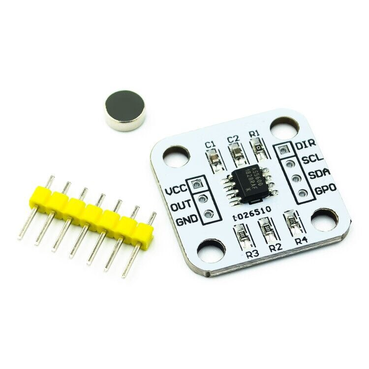
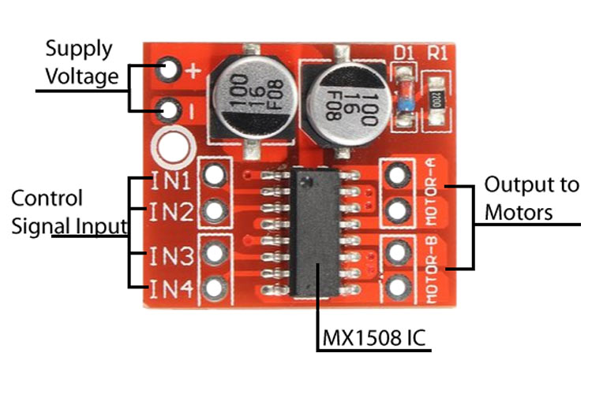

# Indicador de grados
Los componentes eléctricos necesarios para construir este indicador de grados son los siguientes:
### 1. Motor genérico 
* Este motor es fácil de conseguir y su costo es bajo a comparación de un servo motor o un motor a pasos

* Se desarrolla un modelo 3D de este en FreeCad para facilitar los ensambles 

### 2. Modulo AS5600 
* Se usa este mismo modelo 

### 3. Puente H
* Este componente se encarga de manejar el voltaje que llega a las terminales del motor DC, es posible controlar dos motores DC simultáneamente con este driver

* Aunque se puede usar cualquier otro o directamente el arreglo de transistores, pero esta en ti tomar medidas de precaución para evitar dañar el microcontrolador.
* El ciclo de trabajo tendrá que variar, dependiendo del voltaje y corriente de entrada, por lo cual se tiene modificar el código.

### 4. Fuente de alimentación
* Se usa 2.4V  a 1.5A, con este voltaje se realizaron las pruebas pero es posible usar hasta 7V
* **Ademas se usa un motor reductor fabricado en impresión 3D lo puedes encontrar [aquí](../Elementos%20Mecánicos/Indicador%20de%20grados/Piezas%203D.md)**
