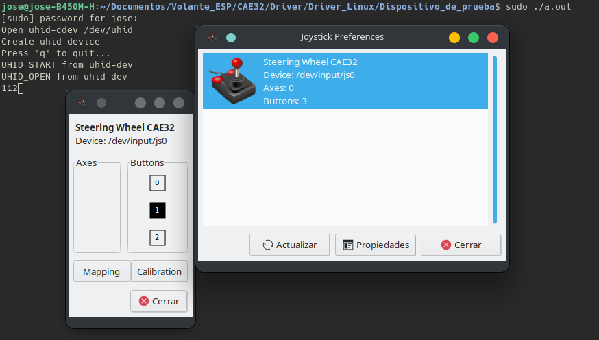
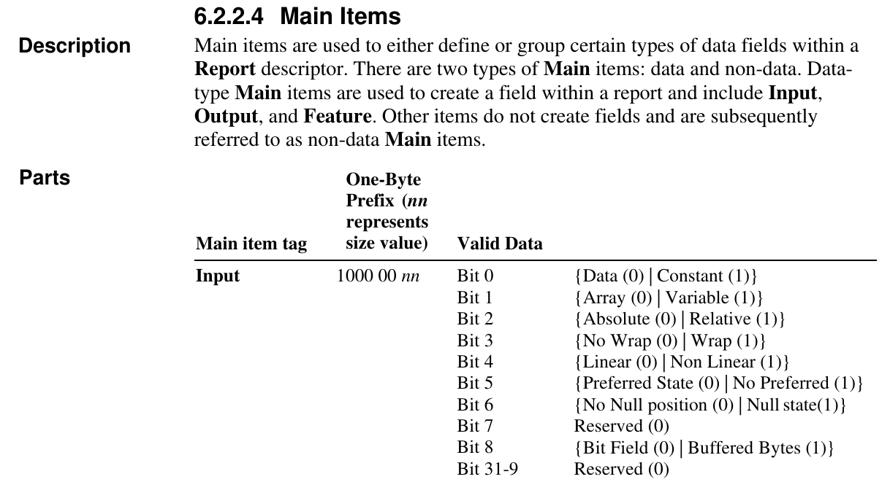
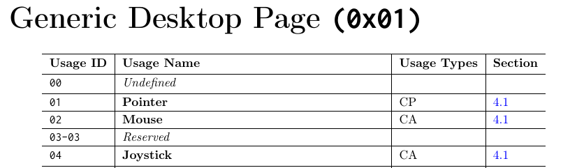
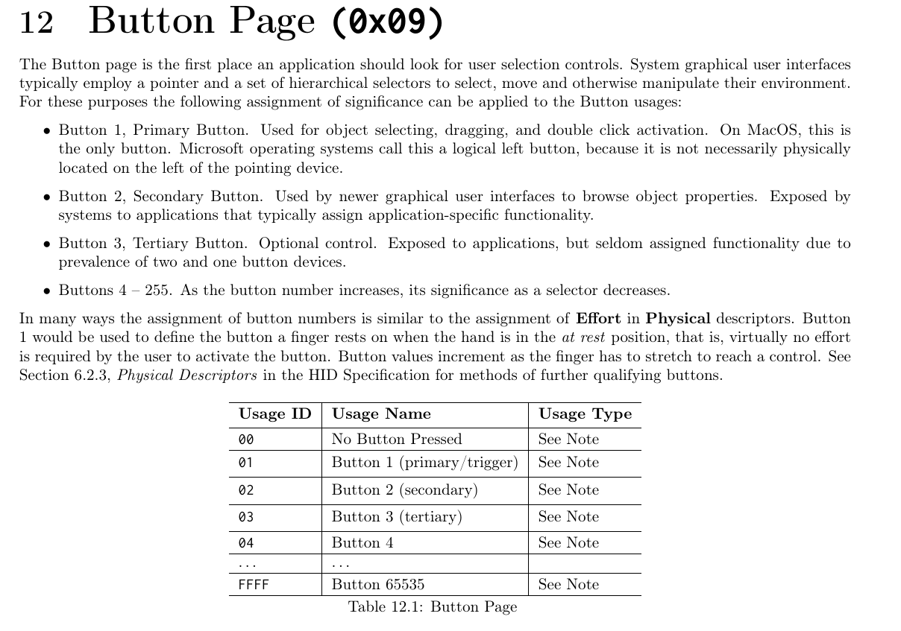

# Dispositivo virtual

Haciendo uso de el ejemplo uhid-example, este lo puedes encontrar [aquí](https://github.com/torvalds/linux/blob/master/samples/uhid/uhid-example.c), 
con este código te muestran como es posible simular un mouse con tres botones y un teclado.

El motivo del por que estoy usando esto, es por que aún esta en desarrollo la PCB, además de conocer como funciona el descriptor HID,
que en grandes rasgos le dice las caracteristas de un dispositivo y el manejo que le debe de dar a los datos, tanto de entrada como 
salida.

El código al compilarse y ejecutarlo como **root** crea un "dispositivo virtual" que al presionar las teclas "WASD" mueve el puntero 
un poco en la dirección de la tecla correspondiente, te recomiendo que veas el link de la parte de arriba para mas información.

Para presentar este dispositivo virtual como un joystick es necesario un cambio

```
static unsigned char rdesc[] = {
	0x05, 0x01,	/* USAGE_PAGE (Generic Desktop) */
	0x09, 0x02,	/* USAGE (Mouse) */
	0xa1, 0x01,	/* COLLECTION (Application) */
``` 
 
a

```
static unsigned char rdesc[] = {
	0x05, 0x01,	/* USAGE_PAGE (Generic Desktop) */ //
	0x09, 0x04,	/* USAGE (Mouse) */ De esta forma se le dice que es un joystick
	0xa1, 0x01,	/* COLLECTION (Application) */
```

y si usamos una herramienta como "jstest-gtk" se ve que lo reconoce como un joystick



**Nota:** Le añadí previamente un nombre personalizado en este caso "Steering Wheel CAE32", en tu caso vendra con el nombre de "test-uhid-device"

## Código

Con esta prevía introducción es hora de crear un joystick con las caracteristicas de CAE32, estas son:

* 4 ejes, para pedales y volante

* 7 botones, para las marchas, 6 marchas y reversa, la neutral se toma como "0"

**Notas**

1. Para esta primera versión de este dispositivo, los ejes tienen una resolución de 1-byte, rango de 0 a 255 o -127 a 126,
lo que puede ser poco para los estandares del momento.

2. Por el momento no se implementa el force feedback (FFB).

3. Los números con _0xnn_ son hexadecimales

### Como se observa todos los tipos de datos son de entrada, por lo cual hay que echar un vistazo, para elegir como vamos a tratar los datos



* Para los pedales creo que la mejor opción es escoger el bit 4 de lineal o no lineal

* Para los botones se usara el bit 1, de matriz o variable

_Al final de este apartado agregaré como queda el código_ 

### Ahora para definir el tamaño de los valores de entrada hay que usar la etiqueta "Report Size"  

* Pedales=8 bits=0x08

* Botones=1 bit=0x01

### Si existen varios datos de entradas similares, como son los botones y pedales se pueden declarar con la siguiente etiqueta "Report Count"

* Pedales=3 campos =0x03

* Botones=8 campos =0x08u
### Ya tenemos definido que tipo y la cantidad de datos de entrada, pero aún falta definir para que lo vamos a usar

La manera en que se usan los datos dependen de varias etiquetas como:

* "Usage Page"

* "Usage"

* "Logical Minimum"

* "Logical Maximum"

* "Usage Minimum"

* "Usage Maximum"

**Nota:** Existen mas tipos de etiquetas de uso, pero estas son las basicas.

Para definir que es un joystick hay que buscar en "las Usage Pages" y lo encontramos en "Generic Desktop Page" con un valor de **0x04**



Ahora hay que asignar el número de botones, este lo encontramos en la pagina de botones



Como se observa podemos definir un rango muy grande de botones para usar, pero en este caso solo en necesario 7 botones, para este primer prototipo

Para definir los Ejes, estos los podemos encontrar en la "Generic Desktop Page" como X,Y,Z,Rx,Ry,Rz

Te recomiendo que veas estos 2 Documentos para que logres enteder mas en profunidad el porque de los valores ya que no abarque todos los temas, aunque puede que en 
futuro los agrege aquí

[Device Class Definition for Human Interface Devices (HID) Version1.11](https://www.usb.org/sites/default/files/hid1_11.pdf)
[HID Usage Tables FOR Universal Serial Bus (USB)](https://usb.org/sites/default/files/hut1_3_0.pdf)

Ya con los cambios realizados nos queda el siguiente dispositivo y se muestra de la siguiente forma en jstest-gtk
