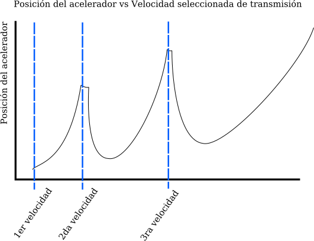
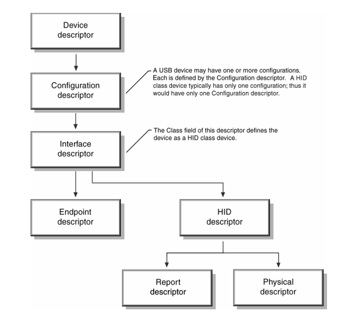
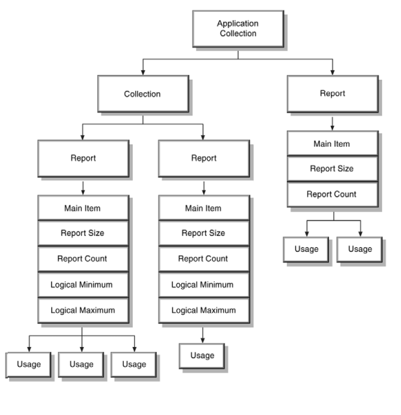

# Device Class Definition for Human Interface Devices (HID) Version1.11

### Enlaces de información 

[Device Class Definition for Human Interface Devices (HID) Version1.11](https://www.usb.org/sites/default/files/hid1_11.pdf)
[HID Usage Tables FOR Universal Serial Bus (USB)](https://usb.org/sites/default/files/hut1_3_0.pdf)

- Debido a que es muy extenso la documentación relacioanad al descriptor de un dispositivo 
de interfaz humana, tomaré nota de cada tema y llenare los huecos tomando como ejemplo a CAE32

## Capacidades de CAE32

Descripción simple de como funcionan los sensores que se encuentran en un 
volante para videojuegos

### Palanca de cambios

En los autos reales solo existen dos estados en los que puede encontrar una velocidad:

* Velocidad acoplada
* Velocidad no acoplada

Esto se puede comparar con una señal digital la cual solo puede estar en dos estados "1" y "0"
lógico, con lo que se puede usar un botón 

**Nota:** Tecnicamente los estados en los que puede estar una transmisión estandar son: el numero
de velocidades del auto mas uno (neutral)


**Ejemplo: Transmisión de auto estandar de 8 velocidades representada en una trama de bits**

|bit|7|6|5|4|3|2|1|0|
|--|--|--|--|--|--|--|--|--|
|Estado|0|0|0|0|1|0|0|0|

Tomando en cuenta que el bit 0 es la reversa y la primera corresponde con el bit 1, segunda con
el bit 2, y así sucesivamente

Se entiende que se encuentra en la tercera marcha, y para identificar neutral sería que todas
las marchas se encuentren desacopladas, exactamente como en la vida real.


|bit|7|6|5|4|3|2|1|0|
|--|--|--|--|--|--|--|--|--|
|Estado|0|0|0|0|0|0|0|0|

### Pedales

Los pedales funcionan dependiendo en cuanta fuerza se aplique y el recorrido de estos

Por ejemplo si quisiera revolucionar el motor al 50% debo de presionar el acelerador hasta la mitad
del recorrido (en dado que este se comporte de manera lineal), 25%=1/4, 
54%=un poco mas de la mitad, etc.

**Ejemplo: Comportamiento del acelerador en relación con la velocidad elegida**



Y a que tipo de señal se compara en el mundo de la electrónica: a la señal analogica

**Ejemplo: Señal analógica en relación con el tiempo**


Y la forma en la que se representa en el mundo digital, es usando un ADC (Analog to DC converter),
el rango de valores que toma depende de su resolución que puede ir desde 8bits hasta 24bits o 
incluso mas, está resolución se podría notar en la sensibilidad de este, lo que se traduce a
un mayor control del auto

**Nota:** la resolución maxima y el formato permitido también depende del juego

**Ejemplo: Valor de un pedal representado en 8bits | Rango de valores (0,255)**

* Valor:183, equivalente a presionar 71% del recorrido total 

|bit|7|6|5|4|3|2|1|0|
|--|--|--|--|--|--|--|--|--|
|Estado|1|0|1|1|0|1|1|1|


### Volante

El comportamiento de un volante es similar al de un pedal, solo que este puede hacer transiciones,
con la diferencia que este puede o no tener un tope físico, esto depende del tipo de transductor
usado, este puede ser un potenciometro, sensor de efecto hall, etc


Desconozco como se toma el valor en el videojuego, lo mas seguro es que se comporte como un pedal,
donde 127 (con una resolución de 8bits) sea el centro y dependiendo de los grados de giro 
de elegidos (normalmente los volantes de entrada cuentan con 900°) los divide y por ejemplo una 
diferencia de 102 se toma como una vuelta completa.

## Resumen

El espacio en bits requeridos para el HID 
 
* 8 bits para la palanca de cambios | 1 bit por cada velocidad o 3 bits, reprentando el valor de la marcha en
binario **Ejemplo** Primera=0x001, Quinta=0x101, Ocatava=0x111 etc

* 32 bits para pedales y volante | 8 bits por cada pedal o volante 


# 5. Operational Model

## 5.1 Device Descriptor Structure

En el nivel mas alto, el descriptor incluye dos tablas

* Información referida al "Device Descriptor"
* Información referida al "String Descriptor"

La estructura de un descriptor principalmente se compone de 

- Class
- Subclass
- Vendor
- Product
- Version
 
Siguiendo este esquema

 

Para un "HID class device" el tipo de "Class" no esta definido al nivel de "Device descriptor"
entonces la clase esta definida en el "Interface descriptor"

## 5.2 Report Descriptor

Aunque los Descriptores seán ilustrados con un diagrama de flujo estos en realidad estan compuestos
en piezas de información conocidos como "Item" 

Un "Item" es una pieza unica de información

## 5.3 Generic Item Format

Un "Item" es un pieza de información acerca del dispositivo, todos los "items" tienen un prefijo del
tamaño de un byte y contiene "item tag, item type, item size" etiqueta, tipo y tamaño

|bits|23-16|15-8|7-0|
|--|--|--|--|
|Partes|[data]|[data]|btag,btype,bsize|
|Bytes|2|1|0|

Un "Item" puede contener "optional item data", el tamaño de la porcion de la "data" de un "item"
esta determinada por el tipo fundamental de dato, existen dos tipos basicos de "item": "short and
long", si un item es corto, "its optional data size may be 0,1,2 or 4 bytes" si un item es largo
el valor de bSize siempre sera 2


**Ejemplo**

|bits|258-24|23-16|15-8|70|
|--|--|--|--|--|
|Partes|[data]|blongItemTag|bDataSize|111/11/10|
|Bytes|3-258|2|1|0|

## 5.4 Item Parser

EL controlador de clases del HID contiene un analizador (Parser) usado par encontrar "items" 
en el reporte de descripción

Este analizador colecta el estado de cada item conocido con forma avanza el descriptor,
y los guarda una tabla de estado de items

La tabla de estados de items contiene el estado de cada item individualmente

Desde el punto de vista del analizador, el dispositivo de clases HID se ve así



Cuando algunos items son encontrados, el contenido de la tabla de estados de items es movida,
estos items incluyen todos lo "Main,Push and Pop" items

Cuando un item "Main" es encontrado, una nueva estructura de reporte es alocada e inicializada
con la actual tabla de estado de items.

Todos los items Locales son removidos de la tabla de estados de items, pero los items Globales
se quedan, de esta forma los items globales definen los valores por defecto de los subsecuentes nuevos items Main

Un dispositivo con muchos controles similares, por ejemplo 6 ejes, necesitaría definir los items 
globales solo una vez en el primer item Main.

**Nota:** Los items Main son asociados con una colección en el orden que en los que ellos fueron
declarados, una nueva colección empieza cuando el analizador llega a un item de colección,
El analizador asocia una colección con todos los items Main definidos entre el item colección y 
el siguiente item fin de colección

Cuando un item Push es encotrado, la tabla de estado de items es copiado y colocada en el "stack"
para su futura recuperación

Cuando un item Pop es encontrado, la tabla de estado de items es remplazada con el "top table from
the stack" 

**Ejemplo**

`Unit (Meter), Unit Exponent (-3), Push, Unit Exponent (0)`

Cuando el analizador alcanza el item Push, coloca la unidad de los items en milimetros `10^-3 
metros`"on the stack", el siguiente item cambia el estado de item de la tabla a unidad de metros 
`10^0 metros`

El Analizador es requerido para analizar todo el reporte del descriptor para encontrar todos los 
items Main, esto es necesario en orden para analizar los reportes enviados por el dispositivo

## 5.5 Usages

Mientras un reporte de descriptor describe el formato de los datos

**Ejemplo** 3 campos de 8 bits

Una etiqueta "Usage" define que se debe de hacer con eso dato

**Ejemplo** entradas "x,y" y "z"


Un reporte de descriptor puede tener multiples etiquetas de "usages"

Existe una correspondencía una-a-una entre "usages" y controles, un control "usage" definido en el 
descriptor

Una matriz indica que cada campo del reporte del descriptor representa varios controles físicos 

Cada control quiza tenga atributos como "usage" asignados a ellos

**Ejemplo** una matriz de 4 botones puede tener una unica etiqueta "usage" por cada botón

Un "usage" es interpretado como un valor de 32 bits sin signo donde el mayor orden, los primeros
16 bits definen el "usage page" y los otros menores 16 bits definen la identificación del uso
"Usage ID" 

"Usage IDS" son usados para seleccionar "usages" individualmente en una "usage Page"

## 5.6 Reports

Una reporte es sinonimo de transferencía
 
Una transferencía quiza se compone de multiple paquetes con un maximo de 
* 8bits para dispositivos de baja velocidad
* 64bits para dispositivos de alta velocidad

Muchos dispositivos generan reportes, o transferencias , retornando una estructura en donde cada
campo de datos es secuencialmente representado, sin embargo, algunos dispositivos tienen multiples 
estructuras de reporte, en un solo endpoint, que cada uno representa solo unos cuantos campos de 
datos

**Ejemplo** Un teclado con apuntador integrado, puede representar reportes independientes de
pulsación de tecla y subsecuente datos del apuntador en el mismo endpoint

"Report ID items" son usados para indicar que campo de dato son representados en cada estructura
de reporte

Un "Report ID" item asigna una etiqueta de un 1 byte identificado con un prefijo en cada transferencia 
de reporte

Si no existe una etiqueta de "Report ID item" esta presente en el reporte del descriptor,
se asume que solo existe un reporte de estructura con "Input, Outpur and Feature" esta presente
y junto ellos representan todos los datos de disposito

**Nota** Solo reportes de "input" son enviados via "interrupt in pipe", reporte de rasgos y salidas
deben ser reportados por el host via "control pipe" o a opcional "interrupr out pipe"

si un dispositivo tien multiples estructuras de reporte, todas las trasnferencias de datos
inician con un prefijo de identificador de 1-byte que indican que estructura de reporte aplica
con la transferencía

Esto permite a "class driver" que distinga los datos del apuntador y del teclado examinando 
el prefijo de transferencía __esto hace referencia al ejemplo anterior del teclado con apuntador__

## 5.7 Strigs

Es una colección de datos que contienen texto asociado y está es opcional

No es necesario usar el item "usage"

El string descriptor contiene una lista de texto para el dispositivo

## 5.8 Format of MultiByte Numeric Values


## 6.2.2 Report descriptor

### 1. Explicación del primer ejemplo 

Este ejemplo muestra como se acomodan los bit en base al report descriptor

```
Report size (3)

Report count (2)

Input

Report size (8)

Input

Output 
```

* Lo que entiendo es que todos los reportes se toman como items globales
* Se "sobreescriben" dependiendo del orden en que estos se encuentran acomodados


* Report size: se identifica como el tamaño de bits
* Report count: Se identifica como el numero de campos 
* Iput y Output se identifica como el tipo de dato

Comportamiento del ejemplo

```
Report size (3)

Report count (2)

Input 
```

1. Asigna dos campos de entrada con un tamaño de 3 bits

` Report size (8)`

2. Se "sobreescribe" el tamaño de bit de los subsecuentes tipos de datos

**Esto es equivalente a realizar esta acción con los siguientes tipos de datos**
 

```
Report count (2)

Report size (8)

Input

Output 
```

3. Asigna dos campos, proveniente de la segunda linea además de asignar una de entrada y salida 
de salida con un tamaño de 8 bits


Un reporte de descriptor puede contener muchos main items

Un reporte de descriptor debe incluir cada uno de los siguientes items para describit el control de los datos
(todos los demas items son opcionales)

- Input(Output or Feature)
- Usage
- Usage Page
- Logical Minimum
- Logical Maximum
- Report Size
- Report Count

**Ejemplo** Los siguiente items son usados para definir un mouse con tres botones, en este caso, todos los main
items son precedentes de los items globales como "usage,report count or report size" (cada linea es un nuevo item

```
Usage Page (Generic Desktop), ;Use the Generic Desktop Usage Page
Usage (Mouse),
	Collection (Application), ;Start Mouse collection
	Usage (Pointer),
	Collection (Physical), ;Start Pointer collection
		Usage Page (Buttons)
		Usage Minimum (1),
		Usage Maximum (3),
		Logical Minimum (0),
		Logical Maximum (1), ;Fields return values from 0 to 1
		Report Count (3),
		Report Size (1), ;Create three 1 bit fields (button 1, 2, & 3)
		Input (Data, Variable, Absolute), ;Add fields to the input report.
		Report Count (1),
		Report Size (5), ;Create 5 bit constant field
		Input (Constant), ;Add field to the input report
		Usage Page (Generic Desktop),
		Usage (X),
		Usage (Y),
		Logical Minimum (-127),
		Logical Maximum (127), ;Fields return values from -127 to 127
		Report Size (8),
		Report Count (2), ;Create two 8 bit fields (X & Y position)
		Input (Data, Variable, Relative), ;Add fields to the input report
End Collection, ;Close Pointer collection
End Collection ;Close Mouse collection
```

### Comprobación y análisis del ejemplo en uhid.c

```
 static unsigned char rdesc[] = {
         0x05, 0x01,     /* USAGE_PAGE (Generic Desktop) */
         0x09, 0x02,     /* USAGE (Mouse) */
         0xa1, 0x01,     /* COLLECTION (Application) */
         0x09, 0x01,             /* USAGE (Pointer) */
         0xa1, 0x00,             /* COLLECTION (Physical) */
         0x85, 0x01,                     /* REPORT_ID (1) */
         0x05, 0x09,                     /* USAGE_PAGE (Button) */
         0x19, 0x01,                     /* USAGE_MINIMUM (Button 1) */
         0x29, 0x03,                     /* USAGE_MAXIMUM (Button 3) */
         0x15, 0x00,                     /* LOGICAL_MINIMUM (0) */
         0x25, 0x01,                     /* LOGICAL_MAXIMUM (1) */
         0x95, 0x03,                     /* REPORT_COUNT (3) */
         0x75, 0x01,                     /* REPORT_SIZE (1) */
         0x81, 0x02,                     /* INPUT (Data,Var,Abs) */
         0x95, 0x01,                     /* REPORT_COUNT (1) */
         0x75, 0x05,                     /* REPORT_SIZE (5) */
         0x81, 0x01,                     /* INPUT (Cnst,Var,Abs) */
         0x05, 0x01,                     /* USAGE_PAGE (Generic Desktop) */
         0x09, 0x30,                     /* USAGE (X) */
         0x09, 0x31,                     /* USAGE (Y) */
         0x09, 0x38,                     /* USAGE (WHEEL) */
         0x15, 0x81,                     /* LOGICAL_MINIMUM (-127) */
         0x25, 0x7f,                     /* LOGICAL_MAXIMUM (127) */
         0x75, 0x08,                     /* REPORT_SIZE (8) */
         0x95, 0x03,                     /* REPORT_COUNT (3) */
         0x81, 0x06,                     /* INPUT (Data,Var,Rel) */
         0xc0,                   /* END_COLLECTION */
         0xc0,           /* END_COLLECTION */
         0x05, 0x01,     /* USAGE_PAGE (Generic Desktop) */
         0x09, 0x06,     /* USAGE (Keyboard) */
         0xa1, 0x01,     /* COLLECTION (Application) */
         0x85, 0x02,             /* REPORT_ID (2) */
         0x05, 0x08,             /* USAGE_PAGE (Led) */
         0x19, 0x01,             /* USAGE_MINIMUM (1) */
         0x29, 0x03,             /* USAGE_MAXIMUM (3) */
         0x15, 0x00,             /* LOGICAL_MINIMUM (0) */
         0x25, 0x01,             /* LOGICAL_MAXIMUM (1) */
         0x95, 0x03,             /* REPORT_COUNT (3) */
         0x75, 0x01,             /* REPORT_SIZE (1) */
         0x91, 0x02,             /* Output (Data,Var,Abs) */
         0x95, 0x01,             /* REPORT_COUNT (1) */
         0x75, 0x05,             /* REPORT_SIZE (5) */
         0x91, 0x01,             /* Output (Cnst,Var,Abs) */
         0xc0,           /* END_COLLECTION */
};
```
Para enteder el descriptor es bastante sencillo en caso de que todos seán "short items", 
ya que estos tienen un rango de 0 a 4 bytes de longitud 

Aunque por el momento no entiendo completamente cuando hay que usar las colecciones

Lo que se dice en la documentación es prestar especial atención al tipo de item,
ya que subsecuentemente sigue el dato

En el ejemplo de se ve obvserva como se escribe en mayuscula el tipo de 
item seguido de su valor entre parentesis


