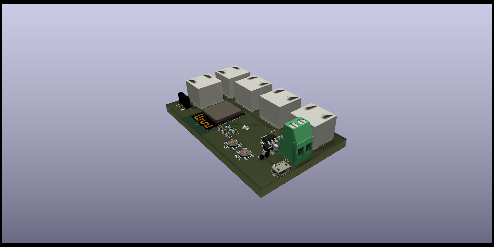
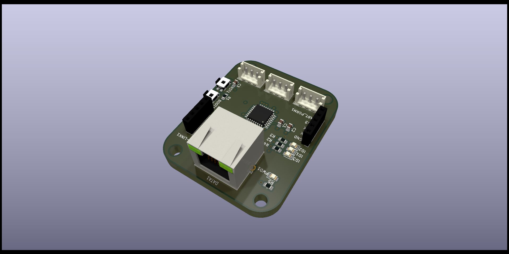
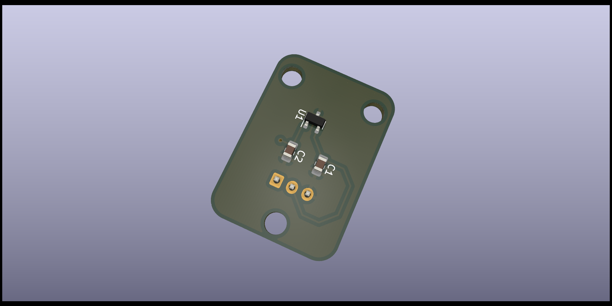
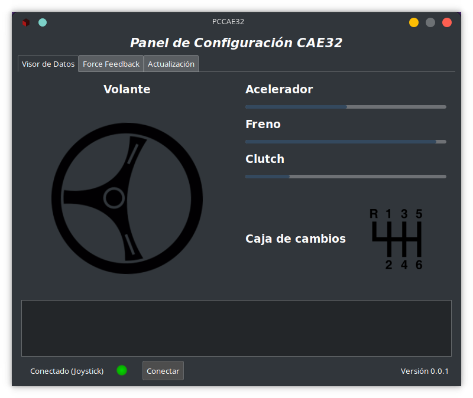

# CAE32

CAE32 es un proyecto de construcción y desarrollo de todas las etapas de un volante para videojuegos de PC,
para el sistema operativo de GNU/Linux.

## Las etapas son:

* Diseño PCB
* Firmware
* Driver (Kernel module)
* Configuración y calibración por medio de una interfaz de usuario (GTK-3)
* Diseño de mecanismos para pedales, palanca de cambios y volante
* Diseño PCB de potencia para el control del motor de retroalimentación (FFB)

## Descripción detallada

### Microcontroladores

Para esta primera versión de Harware, se crean 3 PCB

1. Placa principal (ESP32-S3)

2. Placa para la captura de señales analogicas (STM32G070KBT6)

3. Placa con el sensor hall (MT9105ET)

### Firmware

Estoy usando el framework de Espressif (ESP-IDF) en conjunto con FreeRtos

Aún no inicio con el desarrollo en el microcontrolador STM

### Interfaz de usuario

La interfaz está desarrollada con el framework (GTK 3), esta permitirá hacer configuraciones, como por ejemplo:

* Visualización de los datos gráficamente y textual (consola)
* Tipo de transmisión (Manual, Automática, Secuencial, custom) **De forma nativa**
* Límites de los pedales, sensibilidad 
* Tipo de pedal
	* Entrada analógica (Potenciómetro, efecto hall)
	* Entrada SPI,I2c (Célula de carga)
* Actualización de firmware

Diseño de interfaz hasta el momento.

**Para compilar el proyecto las instruciones las puedes encontrar [aquí](Código/InterfazGráfica/README.md)**

